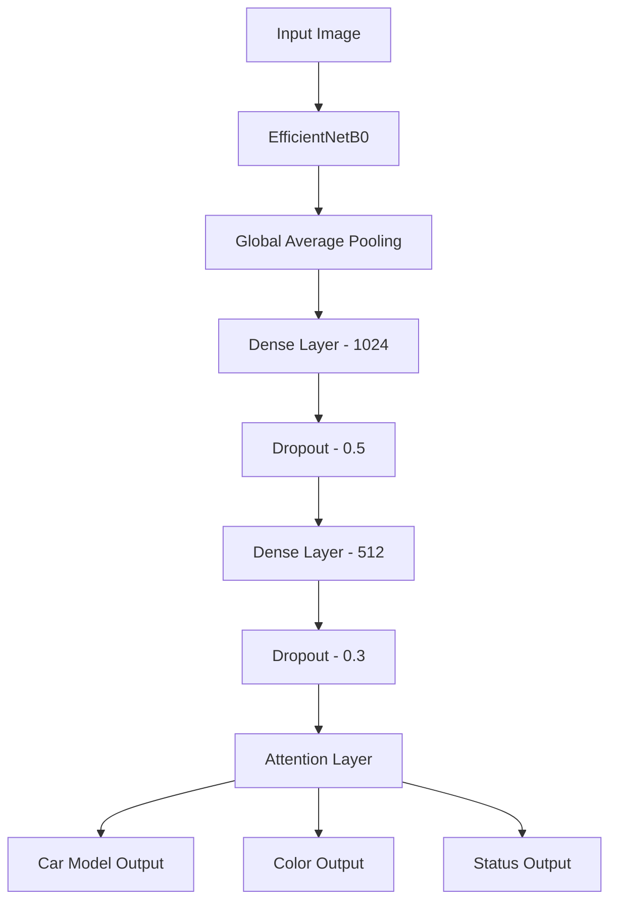

# Persian Car Plate Recognition using Deep Learning

A deep learning model for recognizing car model, color and direction using EfficientNetB0 and custom attention mechanism.

[Iranian License Plate Dataset Request Form](https://forms.gle/CbNBWCbmjRRDoLFr5)


## 🎯 Project Overview

This project implements a multi-task deep learning model to classify:
- Car Model
- Car Color  
- Car Direction

from Persian car images using transfer learning with EfficientNetB0 architecture.

## 📊 Dataset

The Persian Car Dataset contains:
- 1194 labeled images
- 1188 valid images after filtering
- Image resolution: 224x224 pixels
- 3 classification tasks

### Data Distribution

| Category | Train Set | Validation Set |
|----------|-----------|----------------|
| Images   | 950       | 238            |

## 🏗️ Architecture



### Key Components

1. **Base Model**: Pre-trained EfficientNetB0
2. **Custom Attention Layer**: For focusing on relevant image regions
3. **Multi-task Outputs**: Separate classification heads for each task

## 🔧 Implementation Details

### Data Preprocessing
- Image resizing to 224x224
- Normalization (/255)
- Data augmentation:
  - Rotation (±20°)
  - Width/Height shifts (±20%)
  - Shear & Zoom (20%)
  - Horizontal flip
  - Brightness adjustment
  
### Training Configuration
```python
batch_size = 32
epochs = 100
optimizer = 'adam'
loss = 'sparse_categorical_crossentropy'
```

### Loss Weights
```python
{
    'CarModel': 1.5,
    'Color': 1.0, 
    'Status': 1.0
}
```

## 📈 Results

Final model performance after 100 epochs:

### Training Metrics
| Metric | Car Model | Color | Status |
|--------|-----------|--------|---------|
| Accuracy | 99.64% | 99.17% | 99.91% |

### Validation Metrics  
| Metric | Car Model | Color | Status |
|--------|-----------|--------|---------|
| Accuracy | 82.04% | 83.01% | 99.03% |

## 🛠️ Dependencies

- TensorFlow 2.x
- Pandas
- NumPy
- Scikit-learn
- OpenCV
