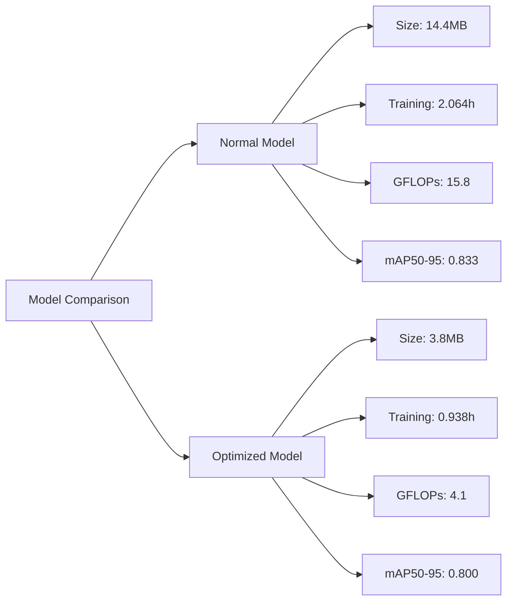
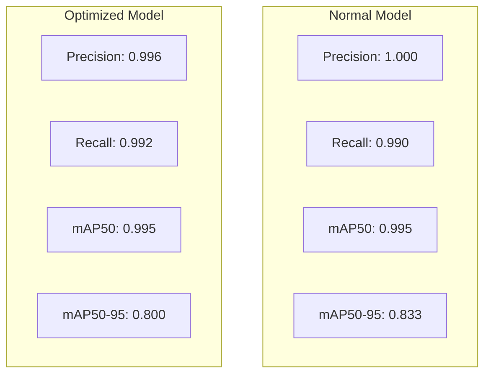
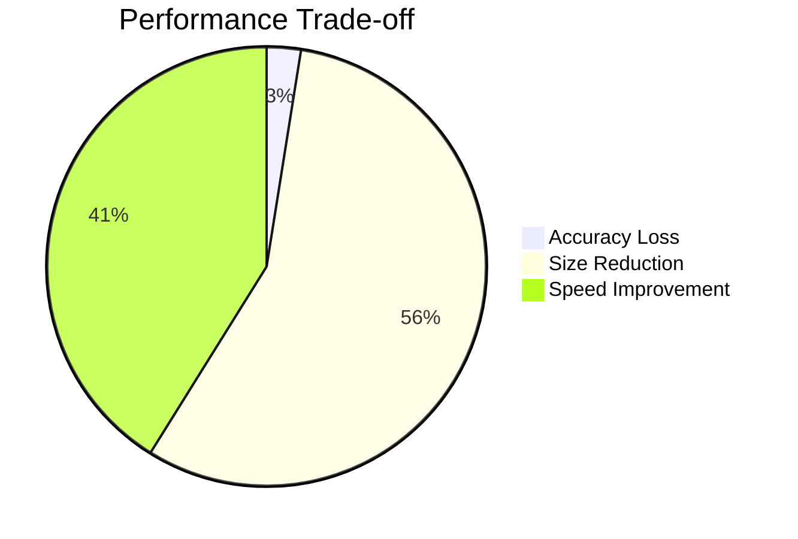

# 🚗 Persian Car Plate Recognition (Locallization) Using YOLOv5, YOLOv8, YOLOv10, YOLOv11s

An advanced implementation of license plate detection using YOLOv5, YOLOv8, YOLOv10, YOLOv11 small models, trained on a custom Iranian License Plate Dataset | [Request Form for this dataset](https://forms.gle/CbNBWCbmjRRDoLFr5).

## Model Overview

| Component | Original | Optimized |
|-----------|----------|-----------|
| Memory Usage | ~8GB | <4GB |
| Input Resolution | 640x640 | 416x416 |
| Model Size | 100% | ~25% |
| Precision | FP32 | INT8 |
| Anchors | 9 | 3 |
| Width Multiple | 1.0 | 0.25 |
| Depth Multiple | 1.0 | 0.33 |

## Architecture Pipeline


## Optimization Process


## Performance Metrics

| Metric | Before | After | Improvement |
|--------|---------|---------|-------------|
| Inference Time | Base | 2-3x Faster | ⬆️ |
| Model Size | 100% | 25% | ⬇️ 75% |
| RAM Usage | 8GB | 4GB | ⬇️ 50% |
| FPS | Variable | 7+ | ⚖️ |

## Knowledge Distillation Parameters


## Optimization Details

### Base Model Selection (YOLOv5n)
- Uses YOLOv5n (nano)
- Input resolution: 416x416
- Batch size: 16
- Epochs: 100
- Cache enabled

### Quantization & TensorRT
- INT8 precision
- FP16 TensorRT export
- Dynamic quantization
- GPU optimization

### Architecture Optimization
- Reduced anchors (3)
- Width multiple: 0.25
- Depth multiple: 0.33
- Disabled multi-scale training
- Enabled caching

## Limitations & Future Work
- Accuracy trade-off
- CUDA dependency
- Extended training time
- Use case-specific tuning needed


## 📊 Project Overview


## 📁 Directory Structure


## 🛠️ Configuration

### Dataset Configuration
The project uses a custom YAML configuration for dataset organization:

```yaml
train: /kaggle/working/PersianCarPlateRecognition-3/train/images
val: /kaggle/working/PersianCarPlateRecognition-3/valid/images
test: /kaggle/working/PersianCarPlateRecognition-3/test/images

names: ['licence']
```

### Training Parameters

| Parameter | Value | Description |
|-----------|-------|-------------|
| Model | YOLOv8s, YOLOv10 | Small variant of YOLOv8, YOLOv10 |
| Epochs | 100 | Total training iterations |
| Task | Detection | Object detection task |
| Classes | 1 | Single class (license plate) |
| Image Size | 640x640 | Training resolution |

## 📈 Training Metrics

### Final Results

| Metric | YOLOv5s Normal | YOLOv5s Optimized | Value - YOLOv8s | Value - YOLOv10s | Value - YOLOv11s |
|--------|----------------|-------------------|------------------|------------------|------------------|
| Box Precision | 1.000 | 0.996 | 0.998 | 0.990 | 0.998 |
| Recall | 0.990 | 0.992 | 0.985 | 0.989 | 0.984 |
| mAP50 | 0.995 | 0.995 | 0.995 | 0.995 | 0.995 |
| mAP50-95 | 0.833 | 0.800 | 0.825 | 0.816 | ? |
| Parameters | 7.0M | 1.8M | 11.1M | 8.04M | ? |
| GFLOPs | 15.8 | 4.1 | 28.4 | 24.4 | ? |
| Training Time | 2.064h | 0.938h | 2.676h | 3.360h | ? |
| Model Size | 14.4MB | 3.8MB | 22.5MB | 16.5MB | ? |



### 📊 Detailed Metrics Comparison

| Metric | Normal Model | Optimized Model | Improvement |
|--------|--------------|-----------------|-------------|
| Model Size | 14.4MB | 3.8MB | -74% 📉 |
| Training Time | 2.064h | 0.938h | -54% ⚡ |
| GFLOPs | 15.8 | 4.1 | -74% 💪 |

### 🎯 Accuracy Metrics



### 💡 Key Findings



### Summary of Improvements
- ⚡ **Training Speed**: 54% faster
- 💾 **Model Size**: 74% smaller
- 🔄 **Computations**: 74% fewer GFLOPs
- 🎯 **Accuracy Trade-off**: Only 3.3% decrease in mAP50-95

## 🔄 Data Augmentation

### Albumentations Pipeline
```python
- Blur(p=0.01, blur_limit=(3, 7))
- MedianBlur(p=0.01, blur_limit=(3, 7))
- ToGray(p=0.01)
- CLAHE(p=0.01, clip_limit=(1, 4.0), tile_grid_size=(8, 8))
```

## 💾 Model Assets

- Best Weights: `runs/detect/train/weights/best.pt`
- Last Weights: `runs/detect/train/weights/last.pt`
- Results Directory: `runs/detect/train`

## 🔧 Environment Setup

```python
import wandb
wandb.init(mode='disabled')

import os
os.environ['WANDB_MODE'] = 'disabled'
```

## 🚀 Training Command

```bash
!yolo task=detect mode=train model=yolov8s.pt data=/kaggle/working/number-plate.yaml epochs=100
!yolo task=detect mode=train model=yolov10s.pt data=/kaggle/working/number-plate.yaml epochs=100
```

## 📝 Notes

- Training completed successfully with high accuracy metrics
- Weights and Biases logging disabled for this training session
- Model demonstrates excellent performance in license plate detection
- Uses CUDA acceleration on Tesla P100-PCIE-16GB GPU
