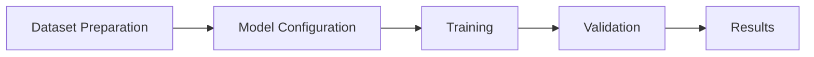
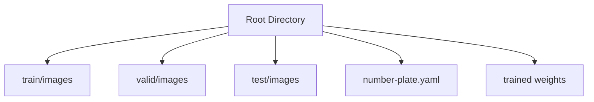

# 🚗 Persian Car Plate Recognition Using YOLOv8 & YOLOv10

An advanced implementation of license plate detection using YOLOv8, YOLOv10 small model, trained on a custom Persian license plate dataset.

## 📊 Project Overview



## 📁 Directory Structure



## 🛠️ Configuration

### Dataset Configuration
The project uses a custom YAML configuration for dataset organization:

```yaml
train: /kaggle/working/PersianCarPlateRecognition-3/train/images
val: /kaggle/working/PersianCarPlateRecognition-3/valid/images
test: /kaggle/working/PersianCarPlateRecognition-3/test/images

names: ['licence']
```

### Training Parameters

| Parameter | Value | Description |
|-----------|-------|-------------|
| Model | YOLOv8s, YOLOv10s, YOLOv10x | Small variant of YOLOv8, YOLOv10 & Large variant of YOLOv10 |
| Epochs | 100 | Total training iterations |
| Task | Detection | Object detection task |
| Classes | 1 | Single class (license plate) |
| Image Size | 640x640 | Training resolution |

## 📈 Training Metrics

### Final Results

| Metric | Value - YOLOv8s | Value - YOLOv10s | YOLOv10x |
|--------|-------|-------|-------|
| Box Precision | 0.998 | ? | ? |
| Recall | 0.985 | ? | ? |
| mAP50 | 0.995 | ? | ? |
| mAP50-95 | 0.825 | ? | ? |

## 🔄 Data Augmentation

### Albumentations Pipeline
```python
- Blur(p=0.01, blur_limit=(3, 7))
- MedianBlur(p=0.01, blur_limit=(3, 7))
- ToGray(p=0.01)
- CLAHE(p=0.01, clip_limit=(1, 4.0), tile_grid_size=(8, 8))
```

## 💾 Model Assets

- Best Weights: `runs/detect/train/weights/best.pt`
- Last Weights: `runs/detect/train/weights/last.pt`
- Results Directory: `runs/detect/train`

## 🔧 Environment Setup

```python
import wandb
wandb.init(mode='disabled')

import os
os.environ['WANDB_MODE'] = 'disabled'
```

## 🚀 Training Command

```bash
!yolo task=detect mode=train model=yolov8s.pt data=/kaggle/working/number-plate.yaml epochs=100
!yolo task=detect mode=train model=yolov10s.pt data=/kaggle/working/number-plate.yaml epochs=100
!yolo task=detect mode=train model=yolov10-x.pt data=/kaggle/working/number-plate.yaml epochs=100
```

## 📝 Notes

- Training completed successfully with high accuracy metrics
- Weights and Biases logging disabled for this training session
- Model demonstrates excellent performance in license plate detection
- Uses CUDA acceleration on Tesla P100-PCIE-16GB GPU
