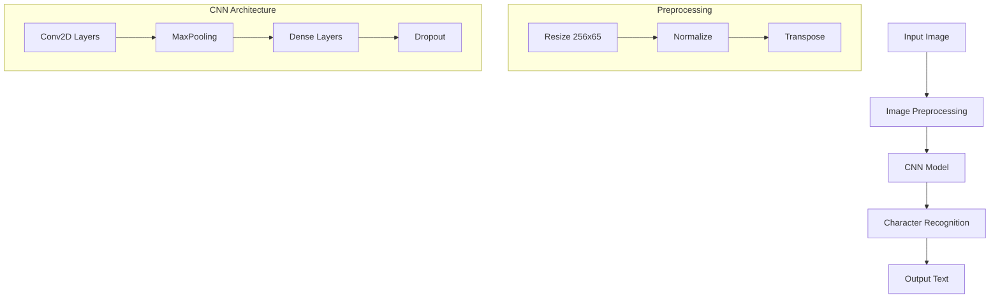
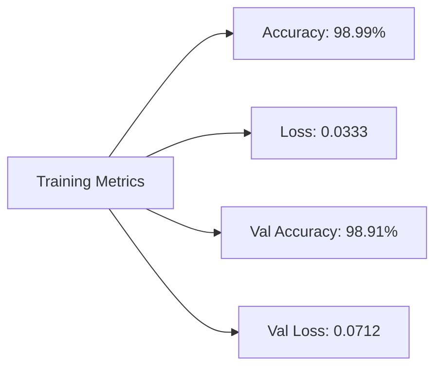

# Persian License Plate OCR

A deep learning model for recognizing Persian license plate numbers using TensorFlow/Keras.


[Iranian License Plate Dataset Request Form](https://forms.gle/CbNBWCbmjRRDoLFr5)

## 📝 Table of Contents
- [Overview](#overview)
- [Project Architecture](#project-architecture)
- [Requirements](#requirements)
- [Dataset](#dataset)
- [Model Architecture](#model-architecture)
- [Results](#results)
- [Installation](#installation)
- [Usage](#usage)

## 🔍 Overview

This project implements an OCR system specifically designed for Persian license plates using Convolutional Neural Networks (CNN). The model achieves high accuracy in recognizing alphanumeric characters from license plate images.

## 🏗 Project Architecture



## 📋 Requirements

```
tensorflow>=2.0.0
numpy
matplotlib
pathlib
```

## 📊 Dataset

- **Source**: Persian OCR Dataset (Medium)
- **Size**: 16,750 images
- **Format**: JPG, JPEG, PNG
- **Resolution**: Normalized to 256x65 pixels
- **Characters**: 39 unique characters including:
  - Numbers (0-9)
  - Letters (A-Z)
  - Special characters (&, -, @)

## 🧮 Model Architecture

| Layer Type | Output Shape | Parameters |
|------------|--------------|------------|
| Input | (256, 65, 1) | 0 |
| Conv2D | (256, 65, 32) | 320 |
| MaxPooling2D | (128, 32, 32) | 0 |
| Conv2D | (128, 32, 64) | 18,496 |
| MaxPooling2D | (64, 16, 64) | 0 |
| Conv2D | (64, 16, 128) | 73,856 |
| MaxPooling2D | (32, 8, 128) | 0 |
| Conv2D | (32, 8, 256) | 295,168 |
| Dense | (16, 4, 128) | 32,896 |
| Dropout | (16, 4, 128) | 0 |
| Conv1D | (16, 4, 64) | 24,640 |
| Dense | (16, 4, 40) | 2,600 |

## 📈 Training Results



- **Epochs**: 20
- **Batch Size**: 16
- **Train/Val Split**: 80/20
- **Early Stopping**: Patience = 30
- **Learning Rate Reduction**: Patience = 10

## 💻 Installation

```bash
# Clone the repository
git clone https://github.com/Awrsha/Persian-Car-License-Plate-Recognition.git
cd Prediction Plate Characters (OCR)

# Install dependencies
pip install -r requirements.txt
```

## 🚀 Usage

```python
# Load and preprocess image
img = tf.io.read_file(image_path)
img = tf.io.decode_jpeg(img, channels=1)
img = tf.image.convert_image_dtype(img, tf.float32)
img = tf.image.resize(img, [img_height, img_width])

# Make prediction
prediction = model.predict(img)

# Decode prediction
decoded_text = num_to_char(prediction)
```

## 📊 Performance Metrics

| Metric | Train | Validation |
|--------|--------|------------|
| Accuracy | 98.99% | 98.91% |
| Loss | 0.0333 | 0.0712 |
```
