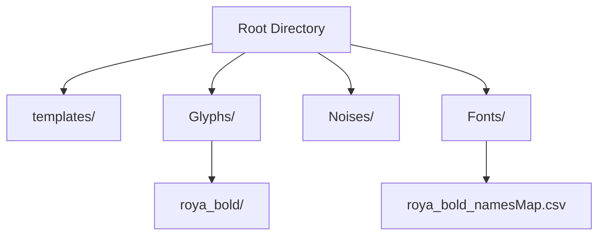
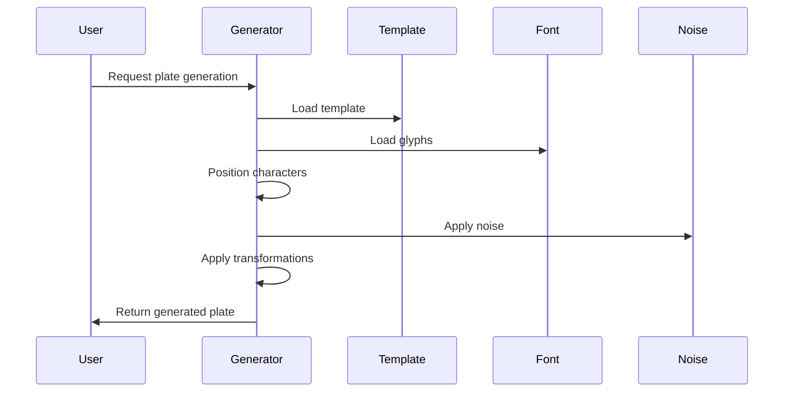

# License Plate Generator

A robust Python application for generating synthetic Iranian license plate images with various styles, transformations, and noise effects.

## 📋 Table of Contents

- [Overview](#overview)
- [Features](#features)
- [Project Structure](#project-structure)
- [Dependencies](#dependencies)
- [Installation](#installation)
- [Usage](#usage)
- [Template Types](#template-types)
- [Technical Details](#technical-details)

## 🔍 Overview

This project generates synthetic Iranian license plates with different templates, fonts, and visual effects for computer vision and machine learning applications.

## ✨ Features

- Multiple plate templates (military, police, diplomatic, etc.)
- Dynamic text positioning and scaling
- Realistic transformations (rotation, zoom, perspective)
- Noise effects simulation
- Multi-threaded processing
- Support for different fonts
- White and regular text variations

## 📁 Project Structure



## 🛠 Dependencies

| Package | Version | Purpose |
|---------|---------|---------|
| Pillow | >= 8.0.0 | Image processing |
| OpenCV | >= 4.0.0 | Computer vision operations |
| NumPy | >= 1.19.0 | Numerical operations |
| imutils | >= 0.5.4 | Image transformations |
| tqdm | >= 4.50.0 | Progress tracking |

## 💻 Installation

```bash
pip install Pillow opencv-python numpy imutils tqdm
```

## 🚀 Usage

```python
from plate_generator import generate_plate

# Generate plates for a specific template and font
generate_plate('template-base', 'roya_bold')

# Generate all combinations
if __name__ == '__main__':
    pool = Pool()
    tasks = [(template, font) for template in templates for font in fonts]
    pool.starmap(generate_plate, tasks)
    pool.close()
    pool.join()
```

## 🎨 Template Types

```mermaid
graph TD
    A[Iranian License Plate Templates] --> B[Military & Defense]
    A --> C[Public Services]
    A --> D[Government & Diplomatic]
    A --> E[Special Purpose]

    %% Military & Defense Branch
    B --> B1[template-artesh<br>'U'<br>ارتش]
    B --> B2[template-sepah<br>'I'<br>سپاه پاسداران]
    B --> B3[template-defa<br>'Z'<br>وزارت دفاع]
    B --> B4[template-Niromosalah<br>'F'<br>نیروهای مسلح]

    %% Public Services Branch
    C --> C1[template-ommomi<br>'E,K,T'<br>حمل و نقل عمومی]
    C --> C2[template-police<br>'P'<br>نیروی انتظامی]
    C --> C3[template-service<br>'&'<br>خدمات فرودگاه]

    %% Government & Diplomatic Branch
    D --> D1[template-diplomat<br>'@'<br>سیاسی و دیپلمات]
    D --> D2[template-dolati<br>'A'<br>اداری و دولتی]

    %% Special Purpose Branch
    E --> E1[template-base<br>'-BCDHJ<br>LMNOQR<br>SVWXY'<br>شخصی و سواری]
    E --> E2[template-tashrifat<br>'#'<br>تشریفات هتل]
    E --> E3[template-gozar<br>'G'<br>گذر موقت و لوکس]
```

## 🔧 Technical Details

### Plate Generation Process



### Supported Transformations

- Rotation (±2° to ±10°)
- Zoom (0.2x to 1.3x)
- Perspective transformation
- Noise overlay
- Resolution adjustment

### Performance Metrics
- **Processing Speed**: Capable of generating over 300 million unique license plates
- **Parallel Tasks**: Processes multiple template-font combinations simultaneously
- **Resource Utilization**: Efficiently uses all available CPU cores

### Optimization Features
1. **Glyph Caching**
   - Pre-loads and caches frequently used glyphs
   - Reduces repeated disk I/O operations

2. **Task Distribution**
   - Each template-font combination runs as a separate process
   - Automatic workload balancing across CPU cores

3. **Memory Management**
   - Efficient image handling using PIL
   - Proper resource cleanup after each generation

### Generation Statistics
For each template-font combination:
- 5 permutations (controlled by `permutations` variable)
- Multiple transformation variants
- Noise pattern variations
- Total combinations = templates × fonts × permutations × transformations × noises

### Usage Tips
- Adjust `permutations` variable for different batch sizes
- Monitor system resources during large-scale generation
- Consider disk space requirements for output storage
